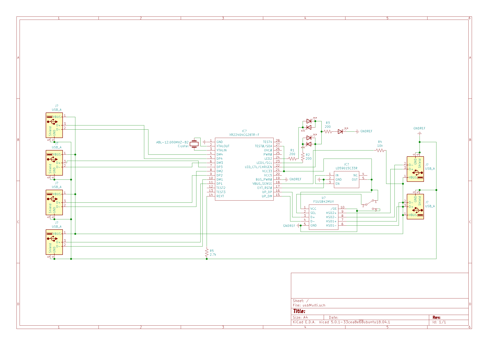

Its a usb multiplexer circuit that takes 4 usb devices, puts them in a single hub, and then switches them from one computer to another at the push of a button. This is intended for use with a keyboard and mouse on multiple systems. Currently no PCB layout was done as there are drastically cheaper alternatives, and the layout is awful cause its a late friday. 

